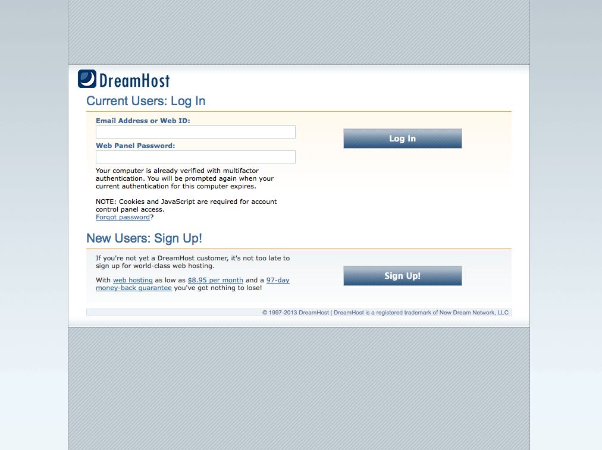
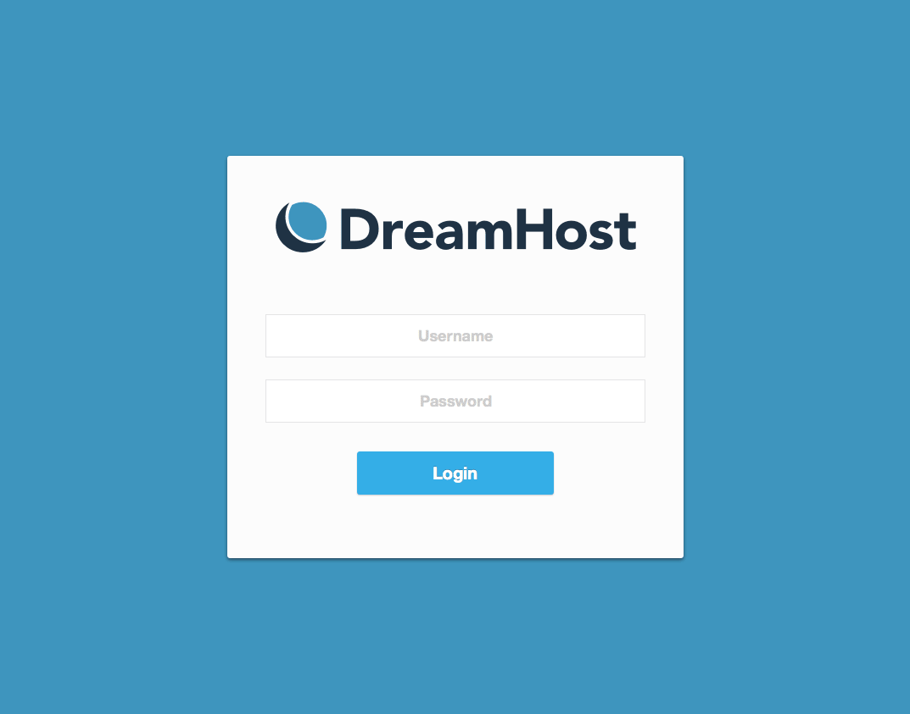
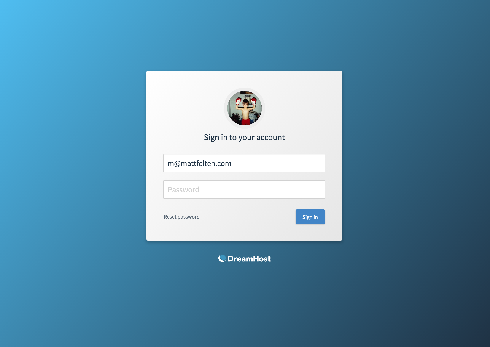

After our [rebrand efforts and redesigned website](../rebrand/) were complete, my attention turned towards the rest of our product. Our control panel needed to get it's fair share of design attention, but it's a huge task. We decided to run an excercise on our login screen to help us refine a visual style to move forward with. The login screen is both a highly visible screen but not a really complex interaction, so it was a perfect place to start.

After stripping the content down to the basics, username and password fields and a way to reset the password, it was really easy to crank out a handful of options and continue iterating until it was bulletproof.

[See more of my work at DreamHost](../)
