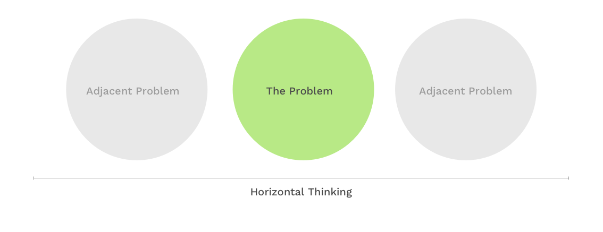
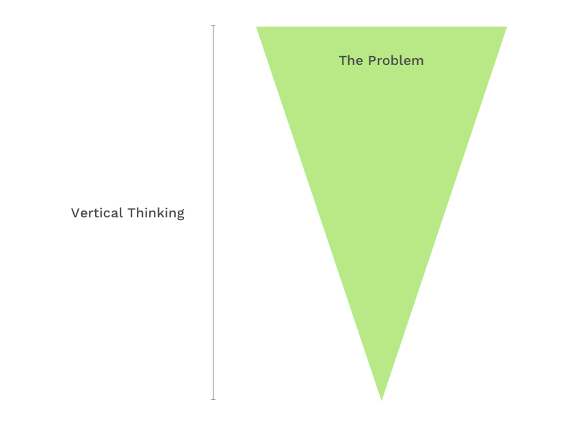

I've been working as the Design System Lead at YouCaring for six months now. One of the lessons I've learned that I'm thinking a lot about right now is about horizontal and vertical thinking and it's place within a design system.

Horizontal thinking is looking at the big picture of the problem, creating consistency across an entire project. Design systems on the surface are about this type of thinking. You are either building a whole system from scratch or most likely inheriting a system of varying degrees of consistency. You need to add and consolidate features into the design system that work across all use cases in your app and some hypothetical ones, making sure all the adopters of the system are able and willing to use them. An unused design system is just pretend work after all.

Vertical thinking is looking at the details of the problem, diving in to see what the unique circumstances are, and figuring out the best way to solve that specific problem. Product Designers are normally doing projects that require vertical thinking. How do we encourage conversion on X page? What's the easiest way for X user to find Y feature? Those are vertical thinking projects, and are really important not only for business growth, but to guide how a design system evolves. The best design system is living and adapting, and this type of thinking is what does that.

When working on a design system, vertical thinking is very important when the system is being implemented. Components in the system need to be consistent but also need to work well once they're implemented. I'll explain.

----

A few months in, after laying the groundwork for the design system, I started work on the gold standard of design system problems - buttons. After looking at our interface inventory, I was able to consolidate all of our different buttons into three common sizes &mdash; small, medium, and large. We also made three different looks &mdash; solid, outlined, and text-only. Then we made five different color variations we might use. That's 45 consistent button styles that we have in our back pocket, which seems reasonable for any use case we'd need a button for. So we started replacing them all. About 300 buttons by best guess.

Finished. Shipped. High fives all around.

It took two weeks for us to find out a button in a key form in our application was now underperforming. The button was quite large. It was replaced with the largest button in our new, theoretically-perfect button system. The result was a button that was about 3/4th the size and was being clicked less. Looking back, I failed to understand why some of the outlier elements came to exist before making a sweeping change for consistency.

----

I could have payed more attention to the fact that I was changing key flows. Documenting high-traffic / high-impact user paths will guide when it is appropriate to do more thorough testing before rolling out all users.

I was also too focused on horizontal thinking, making sure we had a broad button system implemented that worked great for the majority of our application. Had I spent more time vertical thinking - looking at the outliers of what was being changed - I could have noticed how drastically different a couple of them were and then analyzed how to proceed more appropriately. Those edge-cases are important.

Once I notice I'm too focused on either vertical or horizontal methods of thinking, I need to pause and reconsider what is needed for the task. Too much vertical thinking will get too in the weeds with considerations and the design system will become fragmented from exceptions. Too much horizontal thinking will lead to a very consistent but rigid system that doesn't serve business goals. A balance of both is necessary.

[What do you think?]({{site.author.url}})
