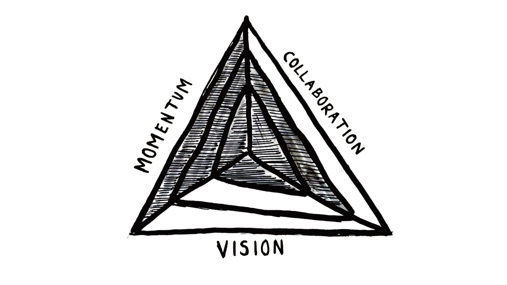

I think a lot about my teams. Right now, I manage two incredible teams, a team of product designers and a team of engineers. 1-on-1's can be challenging, especially across disciplines, because everyone is looking for different things from them. Maybe we want to talk about our career growth plan, or how we can push through a certain challenge. Maybe we talk about ideas for the future of a project. Or we catch up on the newest episodes of True Detective.

I also have certain things I want out of 1-on-1s, and I try to slip that in as we go. I want to really check-in with them. Not just surface-level "How ya doin?" but how life is treating them. I want to understand motivations. Is it working on cool projects? Getting that promotion? I want to know what's next for them, so that I can help make that happen here on my team.

I also want to understand alignment. The large part of the job of a manager is to keep people and projects aligned and headed in the right direction. To add clarity where I can and build excitement. To uncover misalignments as early as possible and help course correct. To help with that I created a framework of 3 pillars I check in on, Momentum, Collaboration, and Vision.

## Three Pillars of Alignment

### Momentum: Keeping the Energy Flowing

Firstly, there's momentum. It's all about finding that balance where work feels engaging, not draining. Keeping the momentum means projects move forward smoothly, and the team feels productive, not just busy. When the team's moving at the right pace, everything feels smoother, and work can feel effortless.

### Collaboration: Creating Magic Together

Building software is a team sport, and how well the team is working together has a direct impact on the outcome. The goal is to foster an environment where everyone feels comfortable sharing their ideas and feedback. Great collaboration means better ideas, less friction, and honestly, makes work more fun.

### Vision: The Bigger Picture

Last, but definitely not least, vision. This is about making sure everyone not only knows what they're doing but also why they're doing it. When the team understands the vision, their work becomes more than just tasks, it's about contributing to something larger. They have the tools to problem solve beyond just their screens. It gives purpose and direction, which is incredibly motivating.

## Using In Practice

I tend to be more direct asking about these. Some folks I've gotten good responses by asking them to rate each pillar 1-5. Some respond best when it's more loose and general. But I make sure I ask every 1-on-1. There's no "correct" answer for the pillars, it's a sentiment check and opportunities to dig deeper into answers.

For instance, a lower feeling of momentum and collaboration but high vision might be because a new project was just kicked off and we're still uncovering how it will be accomplsiehd, but the outcomes are clear. Maybe we should review any project scoping docs and dig into some of the questions.

Another example is if momentum is high, but collaboration and vision are low, that may indicate we're working really hard in isolation towards an unknown outcome. That could definitely be a red flag to dig into, but it could be because they are working on a more experimental idea and still feeling it out.

The point is, there's no right or wrong answers here. It's a framework to get a pulse of where someone is at in their work, and see opportunities to help align.
