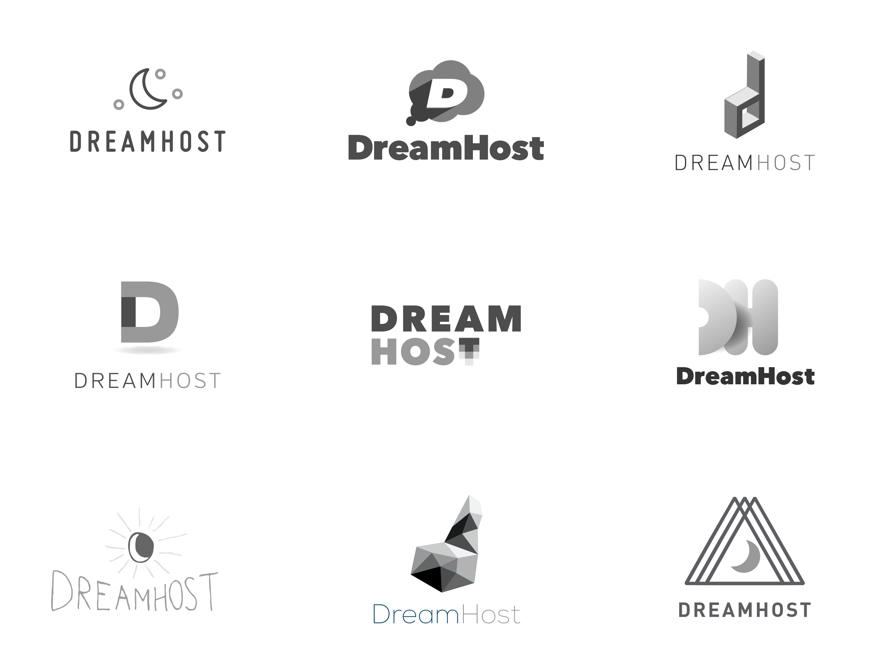
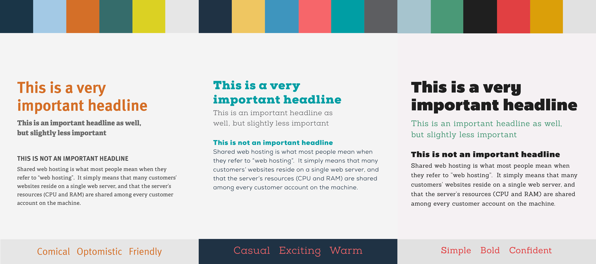
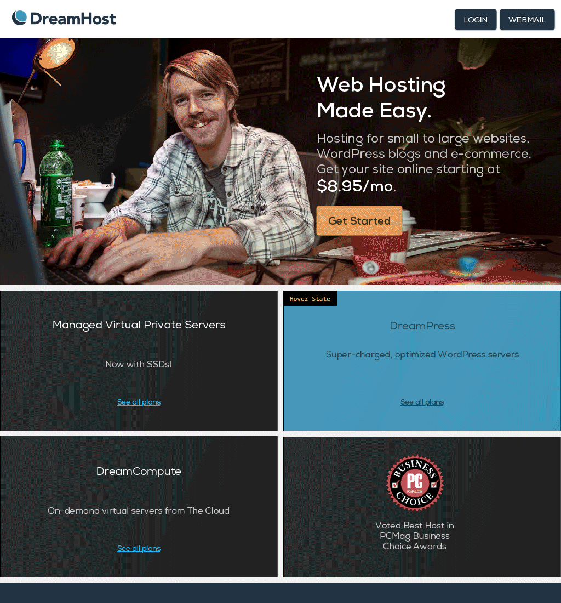
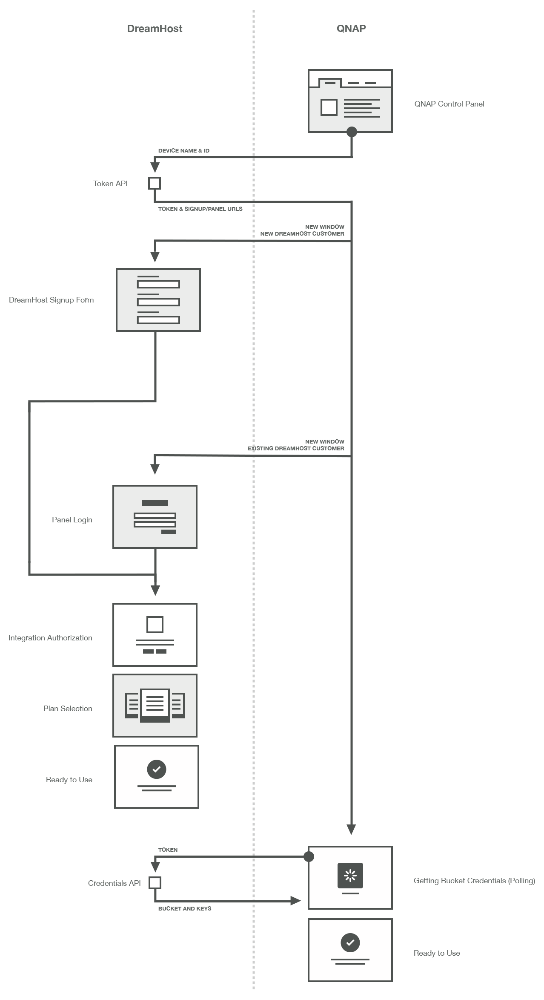
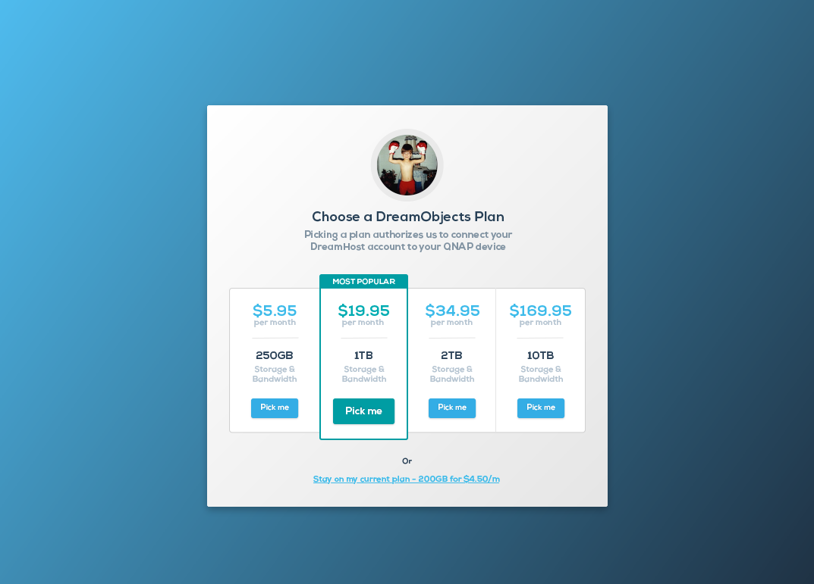

DreamHost is a web hosting company I joined in 2012 as their first outside design hire. I had been a customer for years and had played around with redesigning their control panel in my spare time. When the position appeared in my inbox, it was too good to pass up.

I had a simple goal when I started&mdash;improve the quality of design for the company to make web hosting, a traditionally technical service, into something far more accessible. I love the internet and have made my career through it. I want to make it easier for other people to do the same thing, whether it be learning to code, making a website for their business, or just goofing around.

While working there I worked on a ton of projects that leveled up the design aesthetic. I was also able to hire and lead a small team of really great designers. These are some of the projects I worked on.

	<h2 class="section-title">DreamHost Rebrand</h2>
	
We decided DreamHost needed a facelift. Working with our Creative Director and another designer we refreshed our logo as well as contracted new photography and completely rebuilt our public-facing website from the ground up. I assisted with the design, ran design workshops with stakeholders, as well as lead the development of the website.

	
	
	
	
	

	<h2 class="section-title">QNAP Integration</h2>
	
We turned our cloud storage product into a platform for other companies to offer to their customers. We had to design a customer flow that starts and ends at another services interface which was a pretty unique challenge. We also had to create new screens to support and simplify our sign up and plan selection user flows.

	
	

	<h2 class="section-title">Login Screen Reskin</h2>
	
While preparing to modernize more of our control panel, we decided to run an excercise on our login screen, to help us refine a visual style to move forward with. The login screen is both a highly visible screen but not a really complex interaction, so we thought it'd be a perfect place to start.

	
	
	

