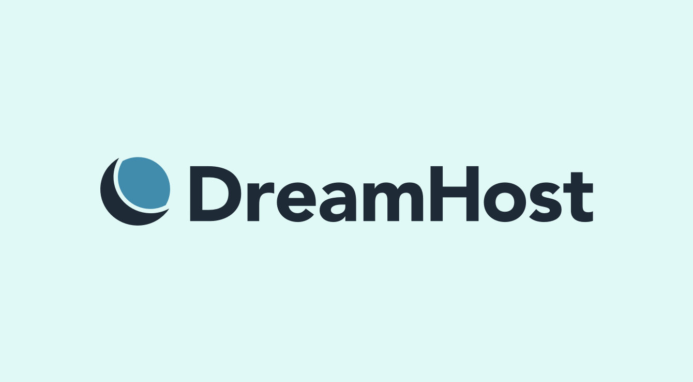
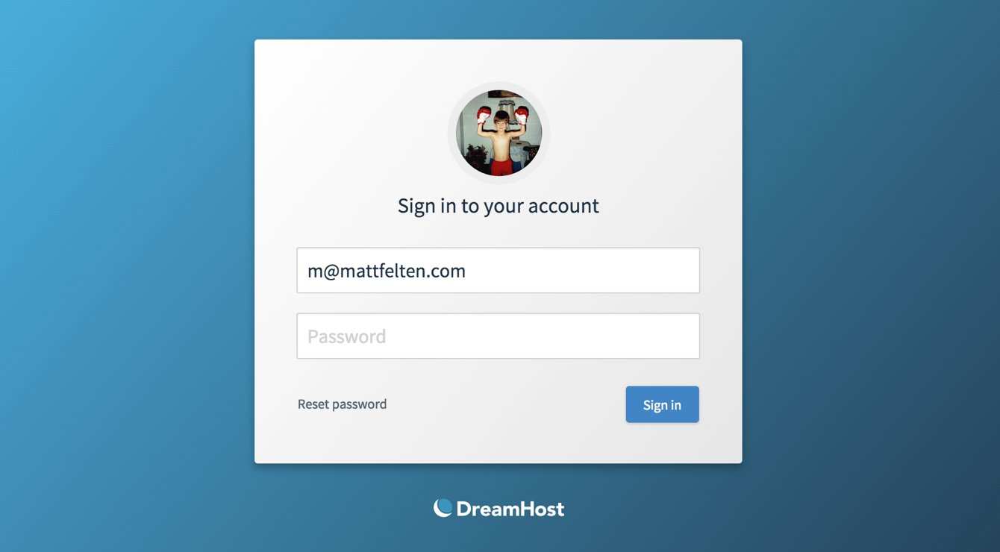
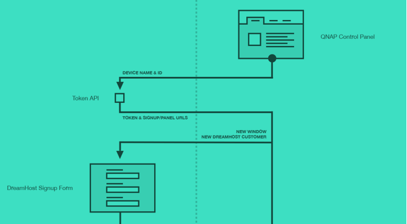
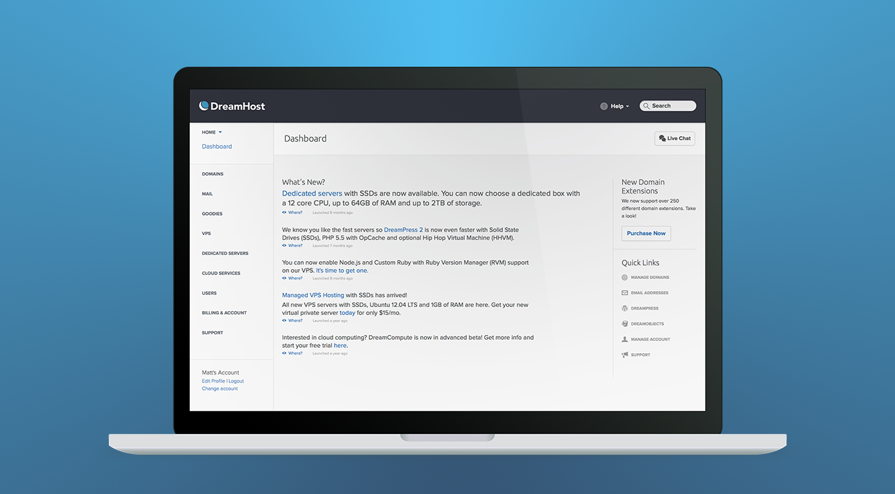

DreamHost is a web hosting company I joined in 2012 as their first outside design hire. I had been a customer for years and had played around with redesigning their control panel in my spare time. When the position appeared in my inbox, it was too good to pass up.

I had a simple goal when I started&mdash;improve the quality of design for the company to make web hosting, a traditionally technical service, into something far more accessible. I love the internet and have made my career through it. I want to make it easier for other people to do the same thing, whether it be learning to code, making a website for their business, or just goofing around.

While working there I worked on a ton of projects that leveled up our design aesthetic and increase adoption of our services. I was also able to hire and lead a small team of really great designers. These are a small selection of the projects I worked on.

<ul class="section section-inner project-list">
	<li class="project project-full">
		<a href="rebrand/" class="image-link">
			

				
			

			
DreamHost Rebrand

		</a>
	</li>
	<li class="project project-half">
		<a href="login-screen/" class="image-link">
			

				
			

			
Login Screen Redesign

		</a>
	</li>
	<li class="project project-half">
		<a href="qnap-integration/" class="image-link">
			

				
			

			
QNAP Integration

		</a>
	</li>
	<li class="project project-full">
		<a href="panel-reskin/" class="image-link">
			

				
			

			
Control Panel Refresh

		</a>
	</li>
</ul>
