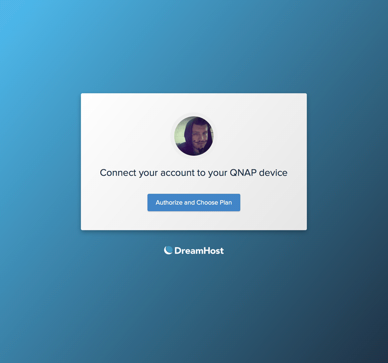

We turned our cloud storage product into a platform for other companies to offer to their customers. We had to design a customer flow that starts and ends at another services interface which was a pretty unique challenge. We also had to create new screens to support and simplify our sign up and plan selection user flows.

The most challenging part of this project was creating a diagram to understand where the customer would be taking certain actions, where they would cross over to our interface. How would it work if the customer was already a DreamHost customer? What about if they aren't? What if they already have DreamObjects on their account? What if they don't?

After going back and forth with the development team, we got the flow to a state where we were all happy. The customer would have the least amount of confusion possible hopping between two different interfaces. Once that was done, we only had to create three new screens. I leveraged the work we did on the [login screen](../login-screen/) and expanded some of those design patterns to work for this kind of one-off flow.

	
The biggest thing I learned through this project was the value of creating flow charts. I spent a few days at the beginning of the project getting concensus on how the system works. I was able to visually explain it to the team and we could all see where our constraints are. It was then exponentially quicker to iterate on to get the best experience possible.

	
<a href="../">See more of my work at DreamHost</a>

